The **AutoAO3App** was made by a fandom coder who wanted a more visually
pleasing way to look at requests during exchanges. It has a few benefits over
the traditional google sheets used by lots of exchanges, including the ability
to bookmark prompts you're interested in, and the ability to filter prompts,
even if you don't own the sheet. The tips below show you how to use this
powerful tool.

## Which Filters To Use

The most useful tab for finding specific requests (and Treatless!) is the
**All** tab, but there are several filters available which simply won't work for
our exchange.

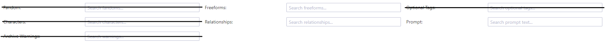

- since we use `Dragon Age - All Media Types` to sign-up filtering by _Fandom_
  won't help.
- _Characters_ only works if the Sign-Up sheet itself uses the Characters field;
  since our sign-up sheet uses the Relationships field this will not work for
  us.
- we do not allow _Optional Tags_ during sign-up.
- we do not use _Archive Warnings_ or _Ratings_ during sign-up.

## Filtering Relationships

If you're looking to create for a specific character or ship or want to see
what's been requested for a specific character or ship this is the place to
start. Using the _Relationships_ field you can search for an entire tag (for
example, `Solas & Mythal`), or for just an individual character (for example,
`Bull`).

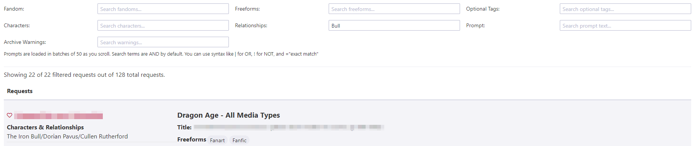

It's important to note that by default the filter does NOT look for exact
matches. In fact it uses an "and" to search. This means that entering
`Bull Hawke` would pull up any tags where both The Iron Bull AND Hawke (Female
Hawke, Male Hawke, Carver Hawke, Bethany Hawke, Leandra Hawke, etc) show up. To
pull up an <u>exact</u> match for a character who shares first or last names
with another character you need to enclose it in quotes (for example, "Male
Hawke").

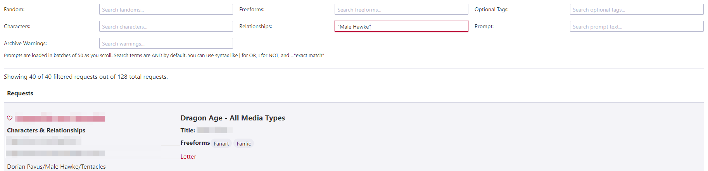

**Other search short cuts include:**

- Using `|` (vertical line) for "or". `Tabris | Mahariel` would provide a list
  of requests where either Tabris or Mahariel (of any gender) shows up in the
  ship.
- Using `!` (exclamation) for "not". `Aeducan !Female` would provide a list of
  requests with Male or Nonbinary Aeducans.
- Combining multiple options. `Alistair Morrigan Amell | Cousland !Female` would
  look for requests with Alistair and Morrigan and either an Amell or Cousland
  not containing the word Female (so Male or Nonbinary).

## Filtering Prompts

The _Prompts_ field is useful as a filter if you're looking to write or draw a
specific trope, kink, etc. For example, if you're really in the mood to give
someone a BDSM treat you can filter on `BDSM`. This field is more limited than
the _Relationships_ field as the "or" and "not" designations do not work.
However, using quotes for an exact match on a phrase <u>does</u> work. This
means you can filter for `"coffee shop au"` and find only that phrase rather
than searching `coffee shop au` and getting results which have `coffee` and
`shop` and `au` as separate searches.

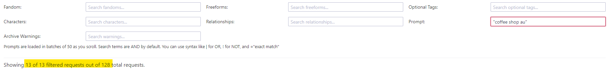

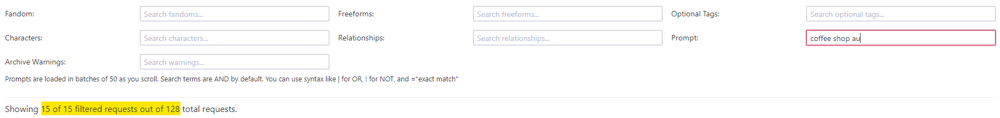

Notice the filter without quotations returns more results than the filter with
quotations.

:::caution

Please be sure to read the prompts that are returned thoroughly. This filter
can't tell if the person has listed your search as a want or a _DNW_, it can
only detect that the words are present in the request.

:::

## Filtering By Type (And Treatless)

In order to help with matching, our sign-ups use the _Freeform_ field to
designate whether fanart or fanfic are being requested. For your assigned
recipient, you should look for the `Fanfic` or `Fanart` tags on their prompt
which designates their desire for their main gift.

If you're looking to complete treats of a specific type, you can search for
participants who want those treats using the below tags:

- `Treats - Fanart` for Fanart treats.
- `Treats - Fanfic` for Fanfic treats.
- `Treats - Other` for alternative fanwork treats.

:::tip

This field is <u>not</u> case sensitive, but it is limited to searching for only
one tag at a time.

:::

:::caution

Be sure to use the full tags listed above for searching for treats to give.
Entering just `Treats` will return every tag that has the word "treats" in it
including `No Treats Please`, and searching for just "fanfic" or "fanart" could
return requests which are only looking for those as a <u>Main</u> gift and not a
treat.

:::

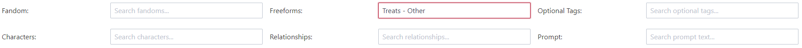

In addition, you can tell if someone has received a treat, because the Mods will
be adding a `Treat Received` tag on their prompts. That means you can find
Treatless participants by searching for `!"Treat Received"` in this field.

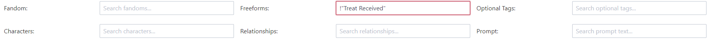

You can read more about treats in the [Treats & Treatless FAQ](/info/treats).

## Searching For AO3 Users

On the far right of the screen there is a **User Search** tab which allows you
to find a specific user's prompt. You can use this to find an easier to read
version of your assigned recipients's requests or look for friends' sign-ups.
The search requires the <u>exact</u> username with punctuation, capital letters,
etc, in order to work.

Simply enter the username in the search and hit go.

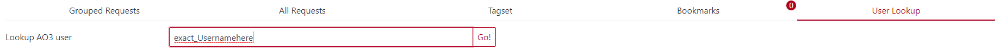

This will pull every request from the user and display them below.

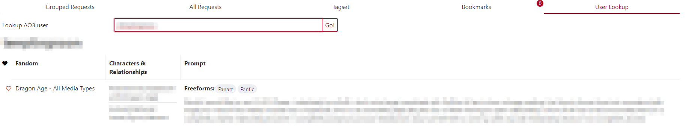

## Filtering The Tag set

AutoAo3 also loads the entire tag set for viewing into the app. You can see the
entire list or filter by character on the **Tag set** tab to the right of the
**All** tab. To view the tags included in our tag set, click on
`All Fandoms in All Categories` → `Dragon Age - All Media Types`. This brings up
the entire nominated tag list. You can then use the _Filter Characters_ field to
look for ships which have a specific character or scroll through to view the
whole list.

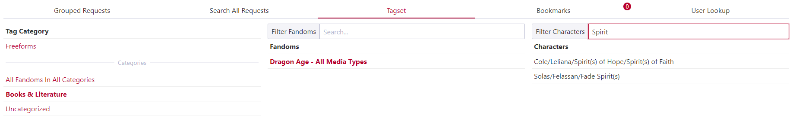

:::note

The Nominations Spreadsheet does remain up throughout the exchange, so you can
always check it for tags as well.

:::

## Bookmarking Requests

You can use the app to bookmark fandoms (not very useful for this exchange) or
specific requests you're interested in fulfilling. The bookmarks are stored
<em>per browser</em>. There are instructions for how to move your bookmarks
across browsers if you need/want to under _Show Backup Instructions_. To
bookmark something, simply click the heart next to the name.

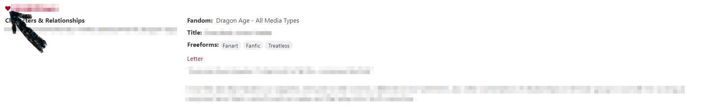

Anything you bookmark is moved to the **Bookmarks** tab for you. To remove,
simply click the heart again.

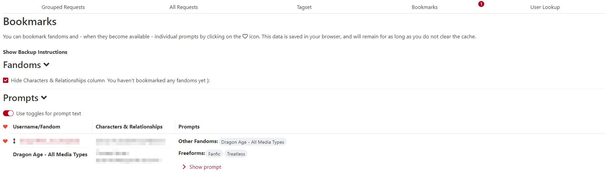
