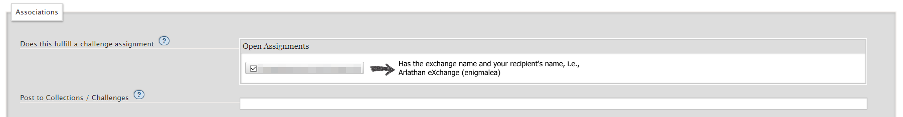
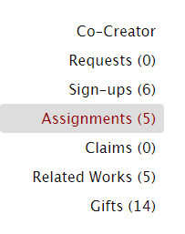
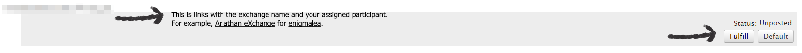
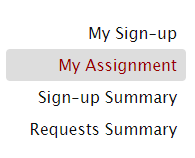
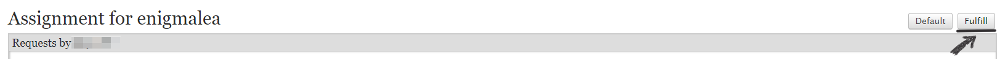

import { Steps } from "@astrojs/starlight/components";

There are three very easy ways to fulfill your exchange assignment once you
receive it.

:::note

These instructions only deal with fulfilling your assigned request for the
exchange. If you're looking for how to give a treat, please see
[Treats & Treatless FAQs: How do I give a Treat?](/info/treats/#how-do-i-give-a-treat)

:::

## From New Work

<Steps>

1. Once you're signed in to AO3, click on `Post` -> `New Work`.
2. Complete the New Work information as normal: Title, etc, etc.
3. In the `Associations` section above the normal **Post to Collection** box,
   you'll see a new section for "Does this fulfill a challenge assignment" and
   next to that a box with check options for which exchange assignment you're
   fulfilling. Check the box for the assignment you want to fulfill, and
   continue posting as normal!
   

</Steps>

:::danger

Both of the methods below require you to select a `Fulfill` button which is
incredibly close to a `Default` button. Please be careful to select the correct
button. If you accidentally default, please email the mods immediately!

:::

## From Your Dashboard

<Steps>

1. Once you're signed in to AO3, click on `My Dashboard`.
2. On the left sidebar scroll down until you see `Assignments` and click the
   link. The number in the parenthesis will depend on how many exchanges you've
   participated in and assignments you've received.
   
3. Find your assignment for Arlathan eXchange and click the `Fulfill` button on
   the right hand side of the screen.
   
4. This will automatically start a new work which will fulfill your assignment!

</Steps>

## From the Exchange Page

<Steps>

1. Once you're signed in to AO3, make your way to this year's AO3 profile for
   the exchange.
2. On the left sidebar scroll down until you see `My Assignment` and click the
   link.
3. You'll see your recipient's requests, and on the right hand side a button to
   `Default` and `Fulfill`. Click the `Fulfill`
   button.
4. This will automatically start a new work which will fulfill your assignment!

</Steps>

## Troubleshooting

### Help! I accidentally defaulted.

Please contact a moderator immediately via email or our exchange Discord.

### I need to edit and I can't find my work.

Your works for exchanges can be found before reveals in a couple of ways:

- From `My Dashboard` on the left-hand sidebar click on `Statistics`.
- From `My Works` on the top right click the `Works in Collections` button.
- From `My Dashboard` go to `Assignments` on the left-hand sidebar and then
  click on the title for your assignment for this exchange.

### How do I post images or other media?

If you're an artist or have created an alternative fanwork (vid, podfic, etc),
you may be curious how to post those to AO3. In short, AO3 does not host
non-text media, but does allow it to be posted.

You can find a simple to follow tutorial on posting images on Mod Enigmalea's
[website](https://enigmalea.quest/fandom/general/ao3/art/).

You can also find information on media hosts on
[Tutorials: AO3 & Non-Fanfic Works](/tutorials/media)
