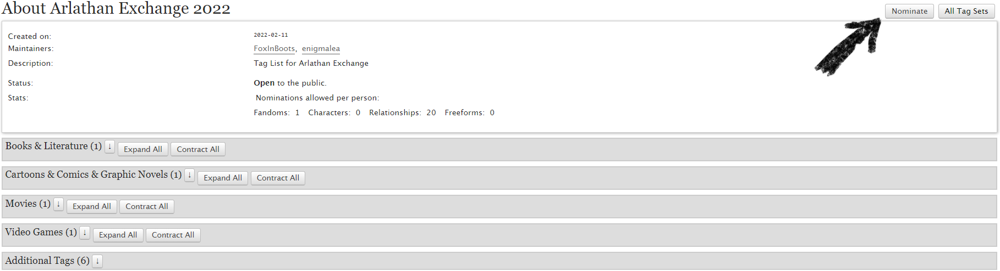
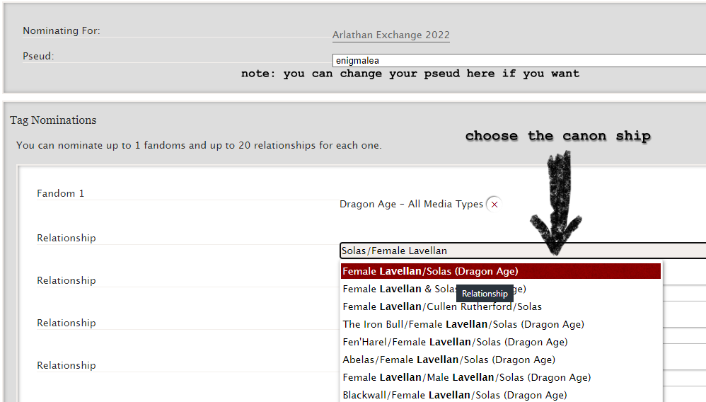
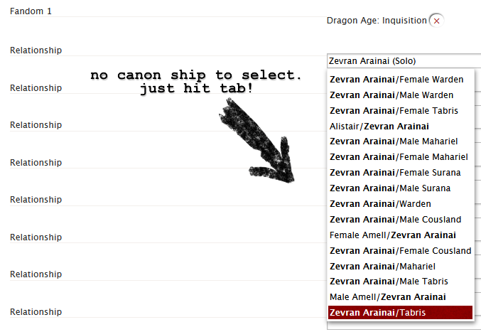
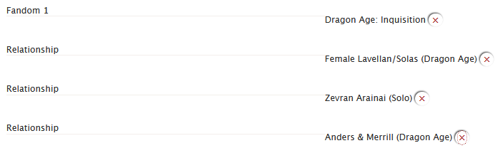

Nominations are where you help the mods create the tags you want to see in the
event. Because tags may or may not exist, and can be formatted in so many
different ways, restricting the tags you can use to a tag set helps the mods
ensure a higher possibility of matching requests with offers. But we have no way
of knowing what you want and just slapping "canonical tags" on the exchange
would limit us to already existing tags. Using a Nomination process for our tag
set allows us to tailor this exchange.

**Each account can nominate up to 20 relationship tags for the exchange.**

:::note

Nominations are not an agreement to participate in the exchange. They're only an
indication you would want to see more content from a character or ship.

:::

1. When nominations are opened we post on our blog and tumblr linking to the tag
   set to be used for that year; a link is also added to this website. To start
   your tag nominations, click on the link to go to the tag set and then click
   the `Nominate` button on the top right.

   

2. Enter _Dragon Age - All Media Types_ for your fandom selection. Enter one
   relationship per box. You can nominate up to 20 relationships. Please follow
   the below guidelines.

   :::note[Nomination Guidelines]

   - **If there is a canonical tag that shows up as a suggestion for your
     nomination please click to add it.**
   - For OC/PC characters (like the Warden, Hawke, or Inquisitor) please include
     a gender, for example, `Male Hawke`. Nonbinary characters can be nominated
     using Nonbinary in place of the gender.
   - **For Rook:** Please include gender and lineage and use canonical last
     names to indicate faction. For example: `Nonbinary Dwarf De Riva`. You may
     indicate you are open to other factions in your prompts/letters, but AO3
     will match using the last name provided.
   - For OCs which are not from in game backgrounds, use tags like
     `Original Male Character(s)`, `Original Female Character(s)`, or
     `Original Nonbinary Character(s)`. We would prefer these tags be as
     specific as possible so if you have a role or race in mind you may use
     things like `Original Male Elvhen Character(s)` or
     `Original Female Templars Character(s)`.
   - Crossover ships are not allowed.
   - For a solo art piece or introspective/epistolary/character study fic,
     please use `[Character Name] (Solo)`; for example: `Solas (Solo)`.
   - Please be sure to use AO3's basic ship guidelines:
   - '/' is to be used for romantic or sexual relationships. (Please use this
     for queer platonic relationships as well.)
   - '&' is to be used for friendships.

   :::

   

   

   

3. When you have nominated all the ships you would like to nominate, scroll to
   the bottom and click the `Submit` button.

Once your nominations have been submitted, the mods will review to make sure if
they are acceptable. _If there need to be edits or clarifications made, we will
post to our blog, tumblr, Discord, and the nominations sheet with details, so
you can edit your nominations._ All accepted nominations will be added to a
nominations google sheet accessible by anyone. The nominations sheet will be
linked on the website and tumblr.

:::note

The mods cannot see who has nominated what tags, so we can't specifically
contact you if your nominations do not fit the guidelines. Please be sure to
watch our communications closely for any issues with nominations so that you can
make corrections!

:::

**Thanks for your interest and happy nominating!**
